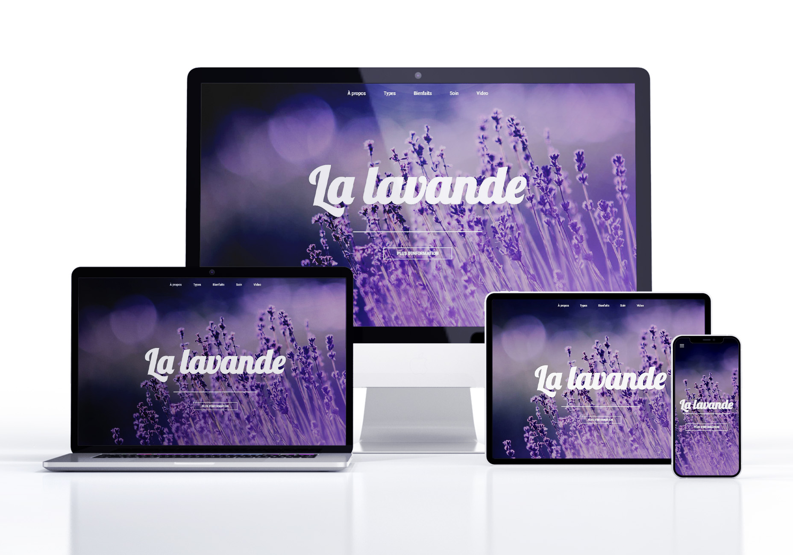

  <h1>La lavande</h1> 
  

<!-- ABOUT THE PROJECT -->
## About The Project

Simple informative landing page about lavande in french.

Built with pure HTML5, CSS3 and Gsap animation.

  

    <a href="https://lavande.glitch.me/">View Demo Here</a>
  

## Built With
[HTML5](https://www.w3schools.com/html/) / [CSS3](https://www.w3schools.com/css/) / [Gsap](https://greensock.com/gsap/)

 
<!-- USAGE EXAMPLES -->
## Usage

Built with pure Html5 and CSS3.

Burger menu with pure Html, Css.

Simple Gsap animations

Mobile responsive.

Project Link: https://github.com/kateFrontend//La-lavande
